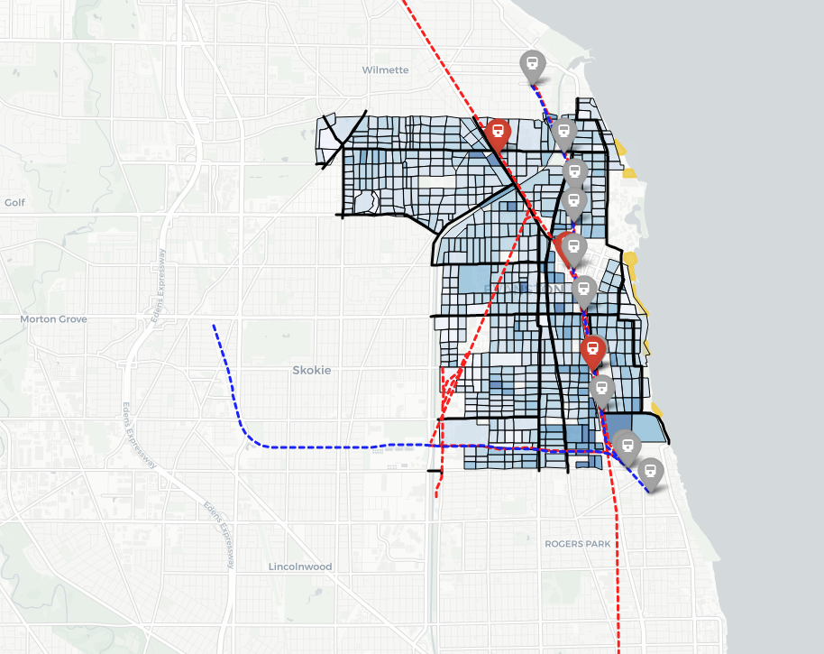
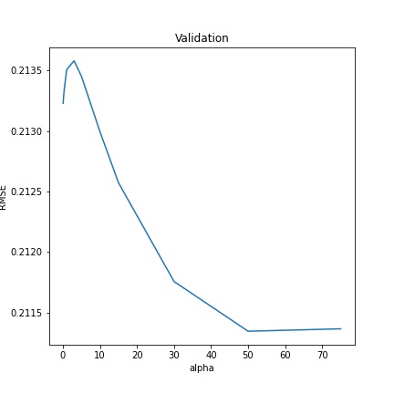
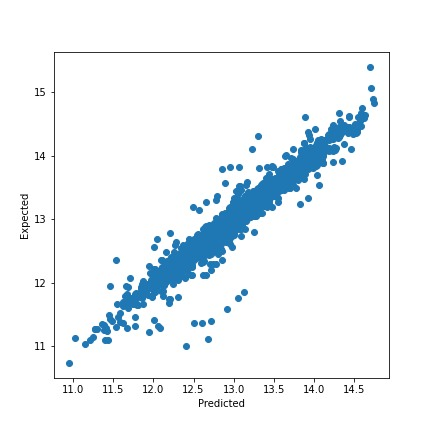
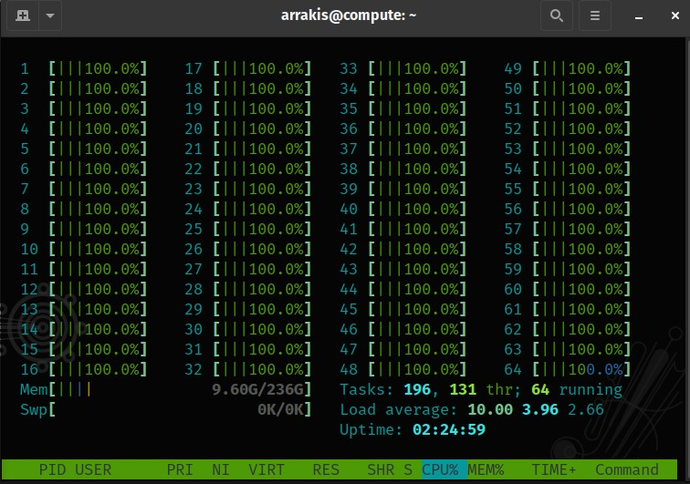

# Problem set 2 
### By: Gómez x2 & Palacio

*Introduction* Hold on to your seat. In the following pages, we are going to tell you about a thing that ourselves just read about a couple of hours ago thanks to the help of dozens of cups of coffee ☕.

## Table of contents

- [Theoretical exercises ✍️](Document/)
- [Empirical problems](empiricos/)
  - [Data](#data)
  - [1. Maps gomelos 📍](#1-maps-gomelos)
  - [2. Out of sight, but not out of mind 📈](#2-out-of-sight-but-not-out-of-mind)
  - 3. Heavy lifting
  - [Scripts](empiricos/)

## Data
We used geographic data from the city of Evanston, a city in the Chicagoland area to graph our maps. the description of the files used is presented below (the names of the files are self-explanatory):
* **cblock.zip**: a compressed shapefile that contains 777 geometry entities corresponding to city blocks.
* **ctract.zip**: a compressed shapefile with the information of the population census divided into 18 territory divisions. Each one of that division aggregate many blocks.
* **El Lines.zip**: also known as the "The Purple Line of the Chicago". El Lines contains the geographic information of the metro line.
* **El Stations.zip**: 11 points corresponding to El's train stations
* **evanston.zip**: the geographic polygon of the city. We don't use this data. We have an ace up our sleeve. 
* **evanston_parcel_data.csv**: a CSV file that contains the information of 22.339 parcels in Evanston city. Some variables included are: Land Square Feet, Rooms, Bedrooms, Age, Total Building Square Feet, etc. 
* **Lake Michigan.zip**: geographic polygon of the Lake Michigan.
* **Major Roads.zip**: geographic lines correspondig to the principal avenues of the city. 
* **Metra Stops.zip**: Metra is the commuter rail system that serves the greater Chicago area. The Union Pacific North Line (UP-N), which connects Chicago’s northern suburbs to downtown Chicago, has stops at Main, Davis, and Central in Evanston. This compressed files contains 3 points.
* **Rail Lines.zip**: geographic lines correspondig to the rail lines. 

Also, we use external files from the [Open Data website of the Evanston city](data.cityofevanston.org) to enrich our models:
* **Beaches.zip**.
* **city.zip**: Enhanced shapefile from Evanston. The geographical borders are updated.
* **parcels_melo.pkl**: Clean version of evanston_parcel_data.csv.
* **tracts.zip**: Enhanced shapefile from tracts. The geographical borders are updated.
* **Trees.zip**.
* **Water bodies.zip**.
* **bici.geojson**: The City of Evanston has approximately 45 miles of protected bike lanes, bike lanes, bike routes and off-street paths. This file contains the polylines of this circuit.
* **cw.geojson**: Geodatabase with points indication school crosswalks.
* **food.geojson**: List with the localization of 394 food establishments.
* [**Data on arrests**](https://data.cityofevanston.org/resource/25em-v4fn.geojson)

The main data can be downloaded from [here](https://github.com/ECON-4676-UNIANDES/Problem_Sets/tree/master/Problem_Set2/data) and auxiliary data can be accessed [here](empiricos/aux_data/)

Some summary statistics can be found [here](empiricos/Analisis_preliminar.ipynb) 

## 1. Maps gomelos

We did some really amazing maps, the easiest way to access them is by cloning the repo and opening them in any browser.

1. [Average assessment values](empiricos/Outputs/Average_assessment_values.html)
2. [Building area to floor ratio](empiricos/Outputs/Building_area_to_floor_ratio.html)
3. [Assessment values](empiricos/Outputs/Assessment_values.html)
4. [link to drive where they can be downloaded](https://drive.google.com/drive/folders/1usNDWGDaZh-vdz_O9Z8GbanekB48U3_3?usp=sharing)

In those HTML files, the 3 red markers represent Metra stations, also, the red dashed lines show the rail line. The gray markers represent El Stations and blue dashed lines indicate the trace of the El lines. We noticed a few outliers on the building area to floor ratio. Those observations with a ratio above the 95 percentile were deleted, probably those correspond to buildings with many floors. Additionally, we saw that the properties near the beach are the most expensive. The principal notebook to build this maps is [here](empiricos/Mapas_interactivos.ipynb). 

## 2. Out of sight, but not out of mind

Our principal results are shown in [this notebook](./empiricos/modelos_chingones.ipynb). We define closeness between blocks with queen criterion (two units are close to one another if they share a side or an edge). With this criterion, we built the $W$ matrix to estimate an Spatial Lag Model (SLM).

However, we perform some previous steps to tidy the data. We correct the skewness of many variables, dropped outliers, and imputed data. We filter the observations to only use the rows corresponding to buildings and selected the principal features of our models with Lasso.

In the exercise of choosing the best alpha for the lasso model, we find that when alpha is small the regularization model cannot capture all the complexities in the data. Therefore, we had the insight to try nonlinear models.

Models like Gradient Boosting regression and Random Forest show better performance to different specifications. Our best model was a Gradient Boosting regression that had an MAE of 0.074 thanks to parameter tuning.

We also tried not successfully to estimate a Spatial Lag Model using a matrix in which proximity was defined using distance. Any observations that were closer than the minimum distance for which every parcel had a neighbour was considered a neighbour. This model failed to converge and used quite a lot of resources, you can find it here [here](empiricos/spreg_1.py).

## 3. Heavy lifting: 

This work heavily relies on cloud computing, specially when defining the spatial variables. Most of the calculations that required expensive operations where done in paralell (we are still figuring out distibuted computing). This can be seen specially in the following scripts: 

1. [server.py](./empiricos/server.py) 
2. [spreg.py](./empiricos/spreg.py) 

These scripts were executed on a 64 cores - 240 gb of memory machine (for this particular task core count was more important than memory). We used our preferred cloud computing platform which is google cloud.

## Final notes: 

1. We made some improvements to "Lake Michigan" so it's shoreline is adjusted perfectly to the city. The script that makes this can be found inside [server.py](./empiricos/server.py) and is based on [Water bodies](https://data.cityofevanston.org/Information-Technology-includes-maps-geospatial-da/Water-bodies/fdqb-ycz3). A geojson versión of the improved version can be found here [lake.geojson](./empiricos/Outputs/lake.geojson) . 

2. On top of the amazing html maps, there are also some convensional versions that can be found here:
  - [Assessed_Value](empiricos/Outputs/Assessed%20Value.png) 
  - [Big map](empiricos/Outputs/graph_1.png)
  - [ratio](empiricos/Outputs/ratio.png) 
  
  
  
  
